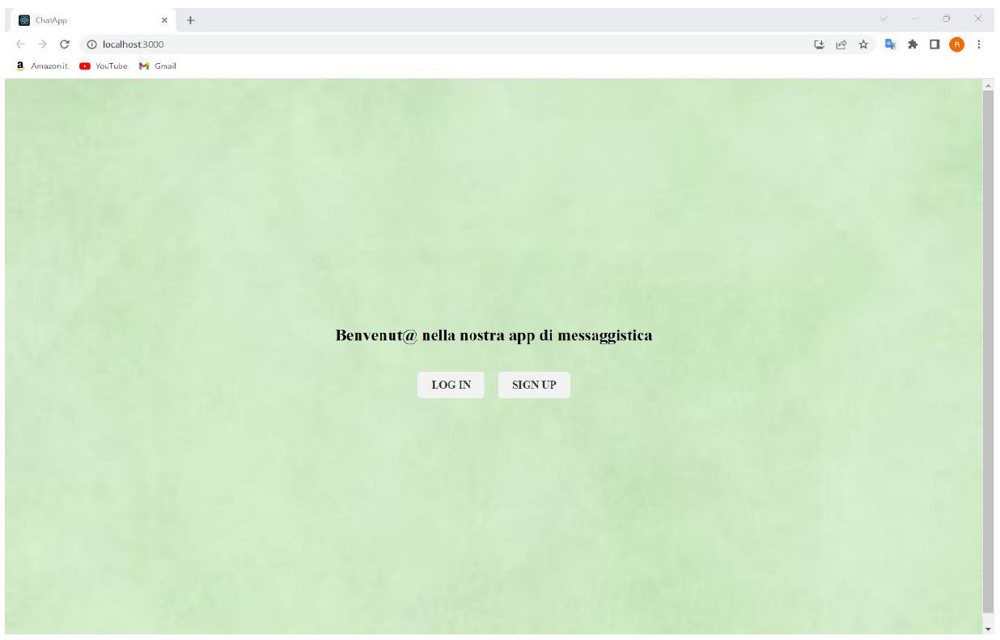
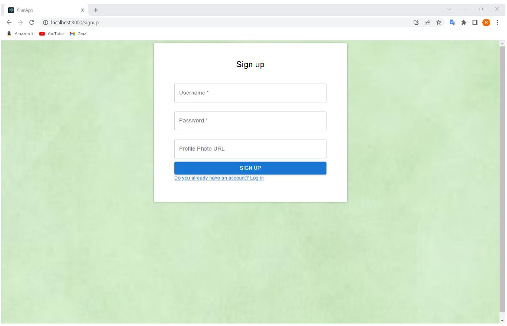
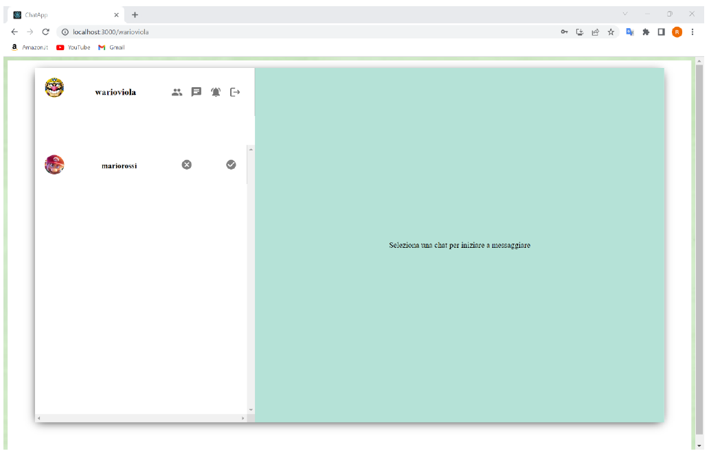
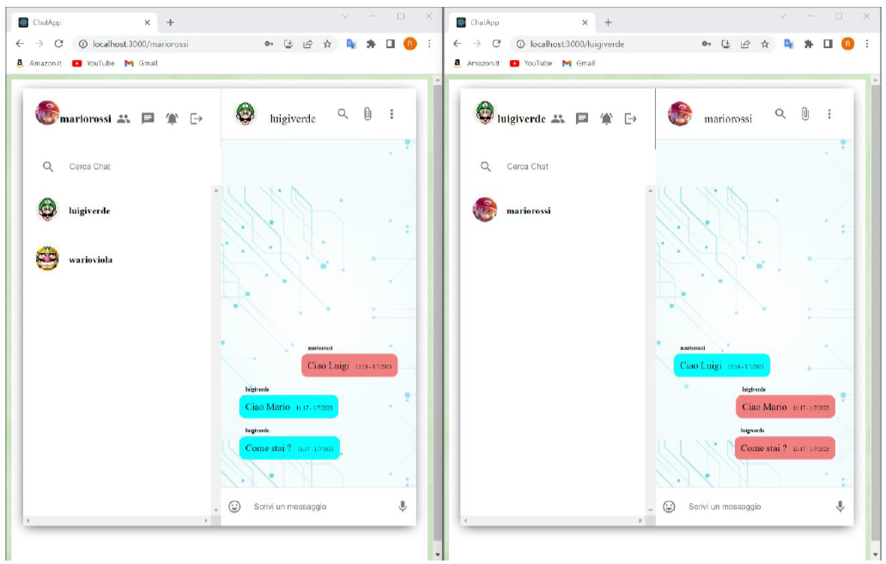

# 📱 Real-Time Messaging Web App


Real-time messaging web application inspired by WhatsApp, developed for an university exam. Built with the MERN stack (MongoDB, Express.js, React.js, Node.js) and Socket.IO, it enables users to sign up, log in, add friends, and exchange messages instantly. 

## 📁 Project Structure

```

web-app-project
│
├── 📁 node_modules/                   # Root dependencies
|── 📁 static/                         # Folder to store example images
├── 📁 whatsapp-be/                    # Backend application
│    ├── 📁 controllers/               # Handles request logic
│    ├── 📁 models/                    # Mongoose schemas
│    ├── 📁 node_modules/              # Backend dependencies
│    ├── 📁 routes/                    # API endpoints
├── 📁 whatsapp-fe/                    # Frontend application
├── LICENSE                             # Apache 2.0 License
└── README.md                           # Project README

```

---

## 📬 Key Features

**User registration or login**  
Users can signup by specifying a username and a password, together with an optional url to set a profile photo. For successfully sessions, the user can login by using its username and password.





**Friend management (add/remove)**  
By clicking on the 'user' icon, it's possible to send a friendship request at a specific user knowing its username.



**Real-time messaging with Socket.IO**  
Here it's possible to appreciate a convesation about the 'mariorossi' and 'luigiverde' users: on the left the mariorossi display, while on the right the luigiverde one.



---

## 🚀 Usage

1. Clone the repository:
```bash
git clone https://github.com/GiuseppeFarano/web-app-project.git
cd web-app-project
 ```
2. Backend Setup
```bash
cd whatsapp-be
npm install
npm start
```
3. Frontend Setup
In a new terminal window:
```bash
cd whatsapp-fe
npm install
npm start
```

4. Access the Application
Frontend: http://localhost:3001
---

## 🪪 License

This project is distributed under the Apache 2.0 License

---

## 👨‍💻 Authors

- Giuseppe Farano
- Raffaele Di Benedetto

---

This project was developed for educational purposes as part of a university course. It is not intended for production use.

If question arises about any part of the project, or you're interested to turn it into live application, feel free to contact the authors.
